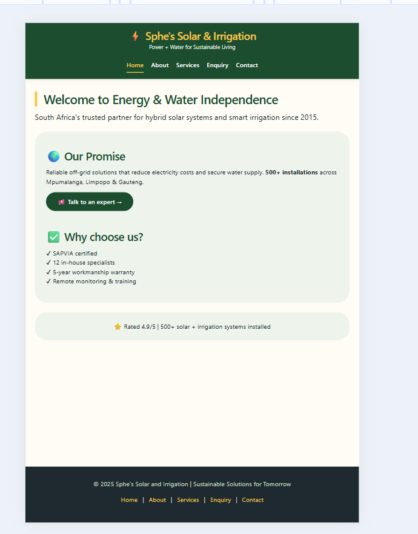
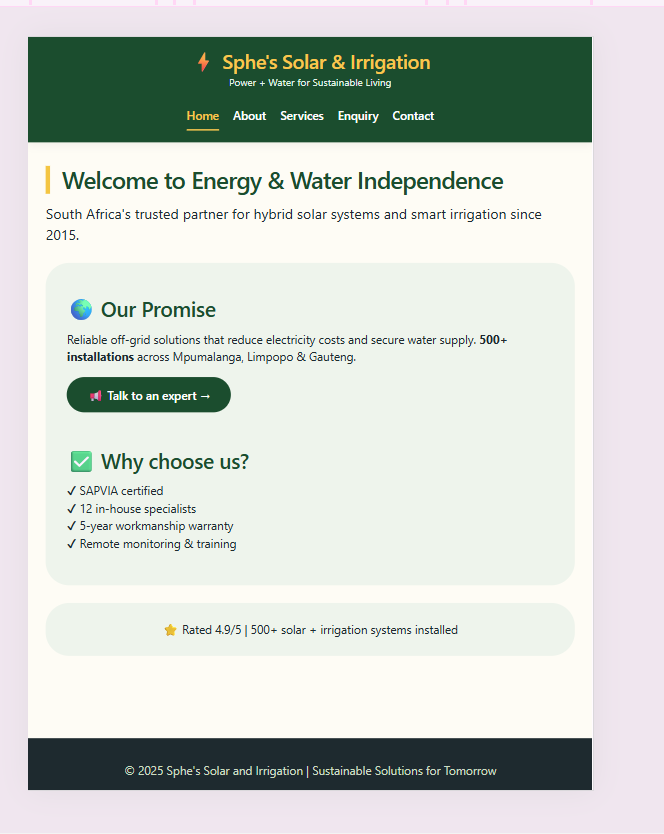
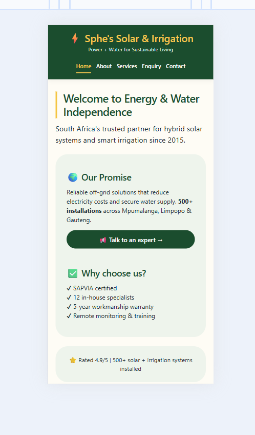

# sphe'ssolar&irrigation
## Changelog

### Part 2 – (Date: 2026-05-28)

#### New features / changes for Part 2:
- Created external CSS file (`css/style.css`) and linked to all HTML pages.
- Implemented CSS reset and base styles for cross-browser consistency.
- Added typography scale using `rem` units.
- Used Flexbox for navigation and mission grid, CSS Grid for services layout.
- Applied visual styles: hover effects, focus states, box-shadows, buttons.
- Made website fully responsive with media queries at 768x (tablet) and 390x (mobile).
- Added responsive image using `srcset` and `sizes` attributes (solar panel photo).
- Tested responsiveness via Chrome DevTools and added screenshots as evidence.

#### Fixes / improvements based on Part 1 feedback:
- Fixed broken navigation links – now each page loads independently.
- Removed inline `<style>` and table-based layout; replaced with semantic HTML and external CSS.
- Added missing `<meta viewport>` for mobile scaling.
- Corrected CSS syntax errors that prevented styling from loading.
## Responsive Design Evidence

| Device | Screenshot |
|--------|------------|
| Desktop (1280px) |  |
| Tablet (768px)   |  |
| Mobile (390px)   |  |
- 

### Part 1 original submission (summary)
- Multi-page website with separate HTML files (Home, About, Services, Enquiry, Contact).
- Basic HTML structure with navigation, content, and footer.
- Initial content about Sphe's Solar and Irrigation (founded 2015, 500+ installations).
- Enquiry form with JavaScript validation.
